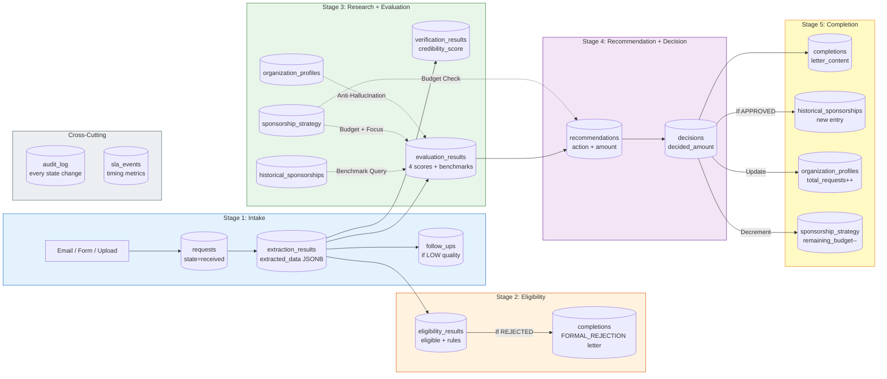

# Data Flow Diagram

## Database Schema & Data Flow Between Agents

```mermaid
erDiagram
    requests ||--o| extraction_results : "1:1"
    requests ||--o| eligibility_results : "1:1"
    requests ||--o| evaluation_results : "1:1"
    requests ||--o| recommendations : "1:1"
    requests ||--o| decisions : "1:1"
    requests ||--o| completions : "1:1"
    requests ||--o| verification_results : "1:1"
    requests ||--o{ follow_ups : "1:N"
    requests ||--o{ audit_log : "1:N"
    requests ||--o{ sla_events : "1:N"

    requests {
        uuid id PK
        varchar display_id "SP-2026-0001"
        varchar state "received/extracted/awaiting_info/eligibility_check/..."
        varchar source_format "email/pdf/webform"
        varchar received_via "email/upload/form"
        varchar source_email
        varchar pipeline_mode "copilot/autopilot"
        timestamptz created_at
        timestamptz awaiting_info_since
        boolean auto_closed
    }

    extraction_results {
        uuid id PK
        uuid request_id FK
        jsonb extracted_data "SponsorshipRequest model"
        float completeness_score "0.0-1.0"
        varchar quality_level "low/medium/high"
        text raw_text_used
    }

    eligibility_results {
        uuid id PK
        uuid request_id FK
        boolean eligible
        varchar rejection_type "FORMAL/POLICY/INCOMPLETE"
        jsonb rules_checked "per-rule pass/fail/skip"
        text[] rejection_reasons "German messages"
        text[] warnings
        boolean llm_used
        jsonb llm_assessment
        float confidence "0.0-1.0"
    }

    verification_results {
        uuid id PK
        uuid request_id FK
        varchar depth "quick/standard/deep"
        float credibility_score "0.0-1.0"
        float web_presence_score
        boolean is_freemail
        boolean registered_association
        boolean website_active
        text[] red_flags
        text[] checks_performed
        text summary
    }

    evaluation_results {
        uuid id PK
        uuid request_id FK
        float strategic_fit_score
        float community_impact_score
        float visibility_value_score
        float cost_effectiveness_score
        float overall_score
        jsonb scoring_breakdown "sub-scores + reasoning"
        jsonb benchmark_comparisons "similar past sponsorships"
        text[] strengths
        text[] weaknesses
    }

    recommendations {
        uuid id PK
        uuid request_id FK
        varchar action "APPROVE/REJECT/PARTIAL/DEFER"
        float recommended_amount
        float confidence
        boolean auto_decidable
        text reasoning
        text[] conditions
        text[] risk_factors
    }

    decisions {
        uuid id PK
        uuid request_id FK
        varchar decision "APPROVED/REJECTED/PARTIAL/DEFERRED"
        float decided_amount
        varchar decision_mode "AUTO/HUMAN"
        varchar decided_by "system/reviewer name"
        text notes
    }

    completions {
        uuid id PK
        uuid request_id FK
        varchar letter_type "APPROVAL/REJECTION/PARTIAL/FORMAL_REJECTION"
        text letter_content "full letter text"
        varchar letter_language "de/en"
        varchar sent_to "recipient email"
        varchar template_used
        timestamptz sent_at
    }

    follow_ups {
        uuid id PK
        uuid request_id FK
        int follow_up_number
        text[] missing_fields
        timestamptz sent_at
        timestamptz response_at
    }

    audit_log {
        uuid id PK
        uuid request_id FK
        varchar action "state_change/email_sent/human_review/..."
        varchar old_state
        varchar new_state
        varchar actor "system/email_watcher/human"
        jsonb details
        timestamptz created_at
    }

    sponsorship_strategy {
        uuid id PK
        varchar client_name
        float total_budget
        float remaining_budget
        jsonb focus_areas "category weights"
        jsonb region_priorities
        boolean active
        int year
    }

    organization_profiles {
        uuid id PK
        varchar organization_name
        varchar relationship_status "NEW/REGULAR/PARTNER/BLOCKED"
        int total_requests
        int total_approved
        float total_amount_given
    }

    historical_sponsorships {
        uuid id PK
        varchar organization_name
        varchar purpose_category
        float amount_approved
        int year
        float outcome_rating "1-5"
        vector embedding "pgvector 1536-dim"
    }

    sla_events {
        uuid id PK
        uuid request_id FK
        varchar sla_type
        float duration_seconds
        float target_seconds
        boolean met
    }

    email_drafts {
        uuid id PK
        varchar draft_type "acknowledgment/completeness/decision"
        text subject_template
        text body_template
    }
```

## Data Flow Per Pipeline Stage

## Table Summary

| Table | Written By | Read By | Rows per Request |
|---|---|---|---|
| `requests` | IntakeService | All agents, Dashboard | 1 |
| `extraction_results` | IntakeAgent | Eligibility, Evaluation, Recommendation | 1 |
| `eligibility_results` | EligibilityAgent | Dashboard, Executor | 1 |
| `verification_results` | ResearchAgent | Dashboard (Live page) | 1 |
| `evaluation_results` | EvaluationAgent | Recommendation, Dashboard | 1 |
| `recommendations` | RecommendationAgent | DecisionAgent, Dashboard | 1 |
| `decisions` | DecisionAgent / Human | CompletionAgent, Dashboard | 1 |
| `completions` | CompletionAgent | Dashboard (letter display) | 1 |
| `follow_ups` | IntakeService | FollowupHandler | 0-3 |
| `audit_log` | All components | Dashboard (audit tab) | 5-15 |
| `sponsorship_strategy` | Config API | Evaluation, Recommendation | 1 (shared) |
| `organization_profiles` | CompletionAgent | Eligibility, Evaluation | 1 per org |
| `historical_sponsorships` | Executor (post-approval) | Evaluation (benchmarks) | 1 per approval |
| `sla_events` | Executor | Reports page | 1-3 |
| `email_drafts` | Config API | Email sender | 3 (templates) |
