# Pipeline Workflow Diagram

## End-to-End Sponsorship Request Processing

```mermaid
flowchart TD
    %% ── Intake ──────────────────────────────────────────────
    subgraph INTAKE ["1. INTAKE (Email / Web Form / Upload)"]
        A1([Email Received<br>via IMAP]) --> A2{Reply or<br>New Request?}
        A1b([Web Form<br>Submitted]) --> A4
        A1c([Manual Upload<br>Dashboard]) --> A4

        A2 -->|New Request| A3[Dedup Check]
        A2 -->|Reply to SP-ID| A10[FollowupHandler<br>Merge Fields]
        A10 --> A6

        A3 -->|Duplicate| A3x([Skip - Already Processed])
        A3 -->|New| A4[Save Raw Document<br>+ Create Request]
        A4 --> A4a[Send Acknowledgment Email]
        A4a --> A5
    end

    %% ── IntakeAgent ─────────────────────────────────────────
    subgraph INTAKE_AGENT ["2. INTAKE AGENT (Document Processing)"]
        A5[Detect Format<br>PDF / DOCX / Email / Image] --> A5a[Extract Text<br>PyMuPDF + OCR]
        A5a --> A5b[Classify Email<br>Rule-based + Haiku]
        A5b -->|Junk / Auto-Reply| A5x([Filtered Out])
        A5b -->|Sponsorship| A5c[Structured Extraction<br>Claude Sonnet + Instructor]
        A5c --> A6[Quality Gate<br>Haiku LLM Assessment]
    end

    %% ── Quality Gate ────────────────────────────────────────
    A6 --> A7{Completeness<br>Check}
    A7 -->|HIGH / MEDIUM| A8([State: EXTRACTED<br>Pipeline Continues])
    A7 -->|LOW - Missing<br>Tier 1/2 Fields| A9[Send Follow-Up Email<br>List Missing Fields]
    A9 --> A9a([State: AWAITING_INFO<br>Wait for Reply or Form])
    A9a -.->|Applicant replies<br>or fills /complete form| A10

    %% ── Pipeline Start ──────────────────────────────────────
    A8 --> P1

    subgraph PIPELINE ["3-7. EVALUATION PIPELINE"]

        %% ── Eligibility ─────────────────────────────────────
        subgraph ELIG ["3. ELIGIBILITY AGENT"]
            P1[Hard Rules<br>Amount / Org Type / Keywords<br>Individuals / Commercial / Violence] --> P1a{All Hard<br>Rules Pass?}
            P1a -->|FAIL| P1b[Rejection Type:<br>FORMAL / POLICY / INCOMPLETE]
            P1a -->|PASS| P2[Soft Rules<br>Region / Date / Freemail / Quality]
            P2 --> P2a{2+ Warnings<br>or Low Confidence?}
            P2a -->|Yes| P2b[LLM Edge-Case Check<br>Haiku - Political Disguise<br>Amount Plausibility]
            P2a -->|No| P3
            P2b --> P2c{LLM Verdict}
            P2c -->|PASS| P3([ELIGIBLE])
            P2c -->|FAIL| P1b
            P2c -->|UNCLEAR| P3a([ELIGIBLE +<br>Needs Human Review])
        end

        P1b --> REJ_LETTER[Generate Rejection Letter<br>CompletionAgent]
        REJ_LETTER --> HITL1{{"HITL: Review &<br>Send Rejection Letter"}}
        HITL1 --> DONE1([COMPLETED<br>Formal Rejection])

        P3 --> EVAL_START
        P3a --> EVAL_START

        %% ── Research + Evaluation (Parallel) ────────────────
        subgraph PARALLEL ["4. RESEARCH + EVALUATION (Parallel)"]
            direction LR
            subgraph RESEARCH ["RESEARCH AGENT"]
                R1[Email Domain Check<br>Freemail Detection] --> R2[Org Name Patterns<br>e.V. / gGmbH / Stiftung]
                R2 --> R3[Web Presence<br>HTTP Check + Scoring]
                R3 --> R4{Depth?}
                R4 -->|STANDARD+| R5[News Mentions<br>Social Media<br>Registry Check]
                R4 -->|QUICK| R6[Credibility Score]
                R5 --> R5a{DEEP?}
                R5a -->|Yes| R5b[LLM Credibility<br>Analysis - Haiku]
                R5a -->|No| R6
                R5b --> R6
            end

            EVAL_START[ ] --> R1
            EVAL_START --> E1

            subgraph EVALUATION ["EVALUATION AGENT"]
                E1[Fetch Strategy<br>+ Benchmarks from DB] --> E2[Build Context<br>Org Record + Anti-Hallucination]
                E2 --> E3[Claude Sonnet Scoring<br>4 Dimensions + Sub-Scores]
                E3 --> E4[Partnership Depth<br>Keyword Analysis]
                E4 --> E5[Portfolio Balance<br>Category Penalty]
                E5 --> E6[Weighted Overall Score<br>28/22/19/16/9/6]
            end
        end

        R6 --> REC_START
        E6 --> REC_START

        %% ── Recommendation ──────────────────────────────────
        subgraph REC ["5. RECOMMENDATION AGENT"]
            REC_START[ ] --> RC1{Overall Score}
            RC1 -->|">= 0.65"| RC2[APPROVE<br>Full Amount]
            RC1 -->|"0.35 - 0.65"| RC3[PARTIAL<br>Reduced Amount]
            RC1 -->|"<= 0.35"| RC4[REJECT]
            RC2 --> RC5[Budget Check<br>+ Confidence Calc]
            RC3 --> RC5
            RC4 --> RC5
            RC5 --> RC6[LLM Reasoning<br>Sonnet - Conditions + Risks]
        end

        %% ── Decision ────────────────────────────────────────
        subgraph DEC ["6. DECISION AGENT"]
            RC6 --> D1{Auto-Decidable?<br>Confidence >= 0.85<br>Amount <= 3000 EUR<br>Mode = Autopilot}
            D1 -->|Yes - Autopilot| D2([AUTO_DECIDED])
            D1 -->|No - Copilot| D3{{"HITL: Human Review<br>AI shows recommendation<br>Human approves / modifies / rejects"}}
        end

        D2 --> COMP
        D3 -->|Human Decides| COMP

        %% ── Completion ──────────────────────────────────────
        subgraph COMP_AGENT ["7. COMPLETION AGENT"]
            COMP[Generate Decision Letter<br>Approval / Partial / Rejection<br>German or English] --> COMP2[Update Org Profile<br>Decrement Budget]
            COMP2 --> HITL3{{"HITL: Review &<br>Send Decision Letter"}}
        end

    end

    HITL3 --> DONE2([COMPLETED])

    %% ── Styling ─────────────────────────────────────────────
    classDef hitl fill:#FFA726,stroke:#E65100,stroke-width:2px,color:#000
    classDef reject fill:#EF5350,stroke:#B71C1C,stroke-width:2px,color:#fff
    classDef done fill:#66BB6A,stroke:#1B5E20,stroke-width:2px,color:#fff
    classDef agent fill:#42A5F5,stroke:#0D47A1,stroke-width:2px,color:#fff
    classDef waiting fill:#FFEE58,stroke:#F57F17,stroke-width:2px,color:#000

    class HITL1,HITL3,D3 hitl
    class P1b,DONE1 reject
    class DONE2 done
    class A9a waiting
```



## State Machine (Linear)

```
RECEIVED -> PARSING -> PARSED -> ELIGIBILITY_CHECK
  |-> REJECTED -> COMPLETING -> COMPLETED (formal rejection)
  |-> ELIGIBLE -> EVALUATING -> EVALUATED -> RECOMMENDING -> RECOMMENDED
        |-> AUTO_DECIDED -> DECIDED -> COMPLETING -> COMPLETED
        |-> HUMAN_REVIEW -> (pause) -> DECIDED -> COMPLETING -> COMPLETED
```

## HITL Checkpoints Summary

| # | Checkpoint | Mode | Default | What Human Does |
|---|---|---|---|---|
| 1 | Eligibility Rejection Letter | Always ON | Draft shown in GUI | Review reasons, edit letter, click Send |
| 2 | Pipeline Decision | Copilot (default) | AI recommends, human decides | Approve / Modify Amount / Reject |
| 3 | Decision Letter Send | Always ON | Draft shown in GUI | Review letter, edit if needed, click Send |

## Agent Cost Summary

| Agent | Model | Cost per Request |
|---|---|---|
| Intake (Extraction) | Claude Sonnet | ~$0.01 |
| Intake (Quality Gate) | Claude Haiku | ~$0.001 |
| Eligibility (Rules) | Deterministic | $0 |
| Eligibility (LLM Edge-Case) | Claude Haiku | ~$0.001 (only if 2+ warnings) |
| Research (QUICK/STANDARD) | HTTP calls | $0 |
| Research (DEEP) | Claude Haiku | ~$0.001 |
| Evaluation | Claude Sonnet | ~$0.01 |
| Recommendation | Claude Sonnet | ~$0.005 |
| Completion (Letter) | Template-based | $0 |
